<p align="center">
  
</p>

<h1 align="center">Glassy System Monitor</h1>

<p align="center">
  <a href="https://www.opendesktop.org/p/2360341">
    
  </a>
  
  <a href="LICENSE">
    
  </a>
  <a href="https://www.opendesktop.org/p/2360341">
    
  </a>
  <a href="https://github.com/Muddyblack/kde-glassy-system-monitor/releases">
    
  </a>
</p>

<p align="center">
  
</p>

<p align="center">
  <a href="#features">Features</a> ·
  <a href="#requirements">Requirements</a> ·
  <a href="#install">Install</a> ·
  <a href="#configuration">Configuration</a> ·
  <a href="#how-it-works">How it works</a>
</p>

---

A glassy real-time system monitor for KDE Plasma 6. Tracks **ping · CPU · memory · network** in one place. The main thing that makes it different from built-in widgets is the ping section — you get live RTT graphs, jitter, and packet loss, not just bandwidth.

## Features

### Monitoring sections

- **Ping graph** — smooth Bézier chart scrolling in real time, RTT in milliseconds
- **Multi-target tabs** — monitor up to 4 hosts at once (e.g. `8.8.8.8`, `1.1.1.1`, your router), switch with one click
- **CPU** — overall usage with optional per-core overlays
- **Memory** — RAM + swap
- **Network** — upload/download bandwidth, session totals, per-interface selection, and an optional SSID / IP readout
- **GPU** — utilization, clock, and an optional **per-engine breakdown** (VRAM, compute, decode, encode) — best-effort across NVIDIA, AMD, and Intel
- **Disk I/O** — read/write throughput per device
- **Power** — battery state and draw
- **Hardware sensors** — temperatures with warning/critical thresholds
- **OS info** — distro and host details
- **Custom command** — chart the output of any shell command on an interval

### Network insight

- **Jitter** — standard deviation over the rolling history window
- **Packet loss** — lost pings shown as red dots on the graph; loss % in the stats bar
- **Alert indicators** — line turns amber above the latency threshold, red at 1.5×; a pulsing border when alerting

### Look & feel

- **Glassy look** — semi-transparent dark card with neon glow, same aesthetic as the [Plasma Audio Visualizer](https://github.com/muddyblack/plasma-audio-visualizer)
- **GPU bloom** — optional GPU-accelerated halo on graph lines, drawn under crisp axis/text so labels stay sharp
- **Frosted glass** — blurred card with adjustable strength (on by default; turn it off for a flat translucent card)
- **Multiple chart styles** — line, bars, donut, pie, horizontal bar
- **Theming** — honors the active Plasma accent color (or set custom colors per section), system text color, configurable background color, and each of the four card corners rounded independently
- **Copyable color codes** — every color picker shows an editable `#rrggbb` hex field with a copy button; the card color shows `#aarrggbb` so the exact transparency can be reused across stacked widgets
- **Tunable poll rate** — one base interval drives every sensor, so you can trade update smoothness for CPU
- **Compact panel mode** — condensed representation for panel placement

---

## Requirements

| Dependency | Notes |
|---|---|
| KDE Plasma 6.0+ | `X-Plasma-API-Minimum-Version: 6.0` |
| `plasma5support` | Provides the `executable` DataEngine used for ping and the fallback stats |
| `ping` (iputils) | Standard on all Linux distros |

Optional, for richer data when present (the widget degrades gracefully without them):

| Tool | Enables |
|---|---|
| `ksystemstats` + `libksysguard` | CPU / memory / network / disk without any polling of our own — ships with Plasma, so this is normally already there. Missing it only means the widget reads `/proc` itself |
| `nvidia-smi` | NVIDIA GPU utilization, encode/decode, VRAM |
| `sensors` (lm-sensors) | Hardware temperature sensors |
| `iwgetid` / `iw` / `nmcli` | Network SSID readout on the `/proc` fallback path (ksystemstats reports it directly) |

---

## Install

<details open>
  <summary><b>Manual (any distro)</b></summary>

```bash
git clone https://github.com/Muddyblack/kde-glassy-system-monitor.git
cd kde-glassy-system-monitor
kpackagetool6 -t Plasma/Applet -i package
# or to update an existing install:
kpackagetool6 -t Plasma/Applet -u package
```

Then right-click your desktop → *Add Widgets* → search **"Glassy System Monitor"**.

To remove:

```bash
kpackagetool6 -t Plasma/Applet -r org.muddyblack.glassySystemMonitor
```

</details>

<details>
  <summary><b>Development / test install</b></summary>

```bash
./test_install.sh
```

To remove the test copy:

```bash
kpackagetool6 -t Plasma/Applet -r org.muddyblack.glassySystemMonitorTest
```

</details>

<details>
  <summary><b>NixOS (flake)</b></summary>

```nix
# flake.nix
{
  inputs.glassy-monitor.url = "github:Muddyblack/kde-glassy-system-monitor";

  outputs = { self, nixpkgs, glassy-monitor, ... }: {
    nixosConfigurations.mybox = nixpkgs.lib.nixosSystem {
      modules = [
        ({ pkgs, ... }: {
          environment.systemPackages = [
            glassy-monitor.packages.${pkgs.system}.default
          ];
        })
      ];
    };
  };
}
```

</details>

<details>
  <summary><b>Package as <code>.plasmoid</code> (for the KDE Store)</b></summary>

```bash
./pack.sh
# produces glassy-system-monitor-<version>.plasmoid
```

</details>

---

## Configuration

Right-click the widget → *Configure*:

| Setting | Default | Description |
|---|---|---|
| **Hosts** | `8.8.8.8,1.1.1.1,192.168.1.1` | Comma-separated ping targets (max 4) |
| **Ping interval** | `2 s` | Time between pings |
| **Timeout** | `2 s` | Per-ping timeout, counts as packet loss |
| **History points** | `60` | Rolling sample count per target |
| **Latency warning** | `100 ms` | Line turns amber above this |
| **Loss warning** | `5 %` | Alert border activates above this loss rate |
| **GPU engines** | on | Per-engine breakdown (VRAM, compute, decode, encode) — shows only what your GPU exposes |
| **Network info** | off | Show current SSID / IP address |
| **Line color** | system accent | Or pick a custom color |
| **Glow** | on | Neon shadow on graph lines |
| **GPU bloom** | on | GPU-accelerated halo on graph lines |
| **Stats bar** | on | Jitter, loss, min/max below the graph |
| **Update interval** | `1000 ms` | Base update rate, floored at 500 ms — the daemon's own tick, so nothing below it would produce another reading. With ksystemstats available CPU/memory/network/disk arrive pushed from the daemon; without it they are polled from `/proc` at this rate in one shared process. GPU 2×, hardware sensors 3×, power 5×, network info 8×, OS info 30× |
| **Card color** | `#800d0f1a` | `#aarrggbb`; the first byte is transparency. Editable and copyable next to the picker |
| **Corner radius** | `12 px` | Set per corner (top-left, top-right, bottom-right, bottom-left) |
| **Card edge** | on | Hairline border and top highlight — the line that reads as glass |
| **Frosted glass** | on | GPU blur of the card's own fill. Off gives a flat translucent card |
| **Frost amount** | `55 %` | Blur strength when frosted glass is on |

---

## How it works

The widget has no compiled backend — it reads from the system through the `executable`
DataEngine, parses the output in QML, and pushes it into a rolling history buffer that
the charts draw.

- **CPU / memory / network / disk** come from **ksystemstats**, the same daemon Plasma's
  own system monitor widgets use. It reads `/proc` in-process every 500 ms and pushes
  values over D-Bus, so the reading happens once for the whole machine however many
  widgets ask for it — no subprocess of ours. That 500 ms tick is both the floor on the
  update rate and the clock the widget samples on: one sample per delivery, and update
  intervals round to a whole number of daemon frames. Sampling on a timer of our own
  instead would beat against it — at an interval of exactly 500 ms the two run at the same
  rate with a drifting phase, and a read landing either side of the daemon's update
  duplicates a value or skips one. Two guards cover what a delivery cannot say on its own:
  a push carries only what *changed*, so an idle interface reporting the same 0 B/s emits
  nothing at all, and a watchdog keeps that graph scrolling flat instead of freezing.
- **Without that daemon** the widget falls back to reading `/proc` itself: `/proc/stat`,
  `/proc/meminfo`, `/proc/net/dev` and `/proc/diskstats` fetched by a single `cat` per
  poll and split back apart in QML, so the four busiest sections still share one process
  rather than forking one each.
- **Ping** runs `ping` per target and parses RTT / loss.
- **Network identity** — SSID / IP come from `iwgetid` / `iw` / `nmcli` and `ip`.
- **GPU** uses `nvidia-smi` on NVIDIA, sysfs on AMD, and DRM `fdinfo` on Intel/others —
  the per-engine breakdown sums each engine's counters across processes and diffs them
  between polls to derive utilization. Each metric appears only when the backend reports it.
  That `fdinfo` scan reads every process's open file descriptors, so it only runs when the
  per-engine breakdown is switched on, or when it is the card's only source of utilization.
- **Sensors** parse `sensors -j`.

Charts use a split-layer renderer: the glowing data lines are drawn to a separate canvas
and blurred on the GPU, then composited *under* the crisp axis, grid, and labels so text
never blurs.

Between data updates the charts scroll, and they do it at the frame rate — a line that is
visibly moving is redrawn every frame, which is the only thing that reads as smooth. The
saving is elsewhere: a chart whose data arrives so rarely that a frame cannot show its
motion (a custom command polled every couple of minutes crawls at a thousandth of a pixel
per frame) redraws on every N-th frame instead, N being how many frames it needs to travel
a twentieth of a pixel. Whole frames, never a "has it moved far enough yet" test — that
one falls due after one frame sometimes and two the next, and an uneven cadence looks like
stutter even when its average rate is right. The ticker stops entirely when there is
nothing to animate: while the popup is closed, for the chart types that do not scroll
(donut, pie, horizontal bars, text), and while the widget is covered by another window.

That last one has no API behind it — nothing tells a plasmoid it has been covered up. But
a `Canvas` only runs its paint handler during a real render pass, so a paint that was
requested and never arrived means nothing is drawing us. The widget watches for that and
drops to one probe per second until a paint lands again. Data collection carries on
throughout, so uncovering the widget shows a complete chart rather than a gap.

Data never arrives exactly on time, and the scroll is built so that this never shows. Each
chart slides by one history step per update, so a sample landing *early* would otherwise
snap the line forward and a *late* one would leave it stranded — the widget carries the
difference into the next cycle instead, and the line keeps the speed it already had
straight through the update. When a sample is late enough to run the scroll off the end of
its step, the motion eases to a stop over a quarter second rather than halting on a frame,
and picks up from exactly there when the data lands. The upshot is that no update interval
looks different from any other: the line glides at a near-constant rate whether the samples
behind it are early, late, or missing.

