<p align="center">
  
</p>

<h1 align="center">Glassy System Monitor</h1>

<p align="center">
  <a href="https://muddyblack.github.io/kde-glassy-system-monitor/">
    
  </a>
  <a href="https://www.opendesktop.org/p/2360341">
    
  </a>
</p>

<p align="center">
  
  <a href="LICENSE">
    
  </a>
  <a href="https://www.opendesktop.org/p/2360341">
    
  </a>
  <a href="https://github.com/Muddyblack/kde-glassy-system-monitor/releases">
    
  </a>
  
</p>

<p align="center">
  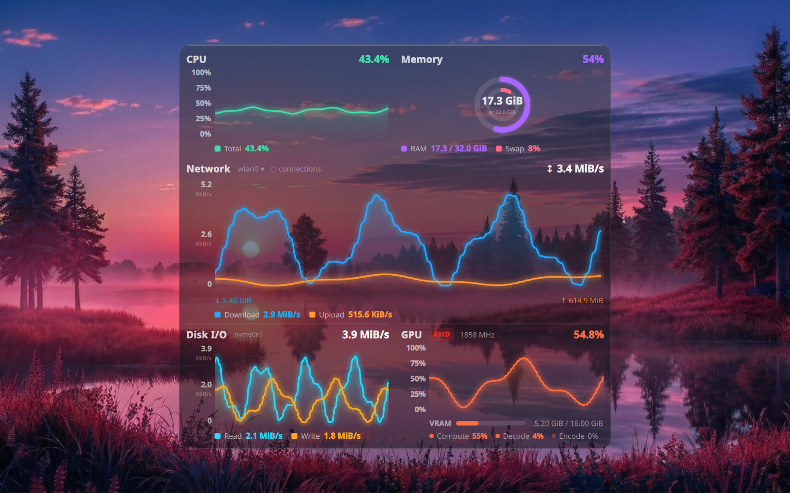
</p>

One widget for CPU, memory, network, ping, disk, GPU, storage, processes, sensors, power,
system info and your own commands, in the order and layout you want. Charts run on the GPU,
and everything is set up in a studio with a live preview. Works on KDE Plasma 6 and on
Hyprland through Quickshell.

## Looks

<p align="center">
  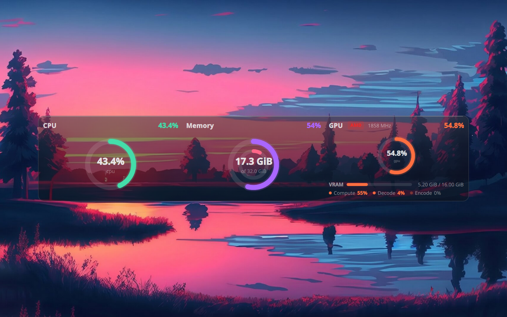
  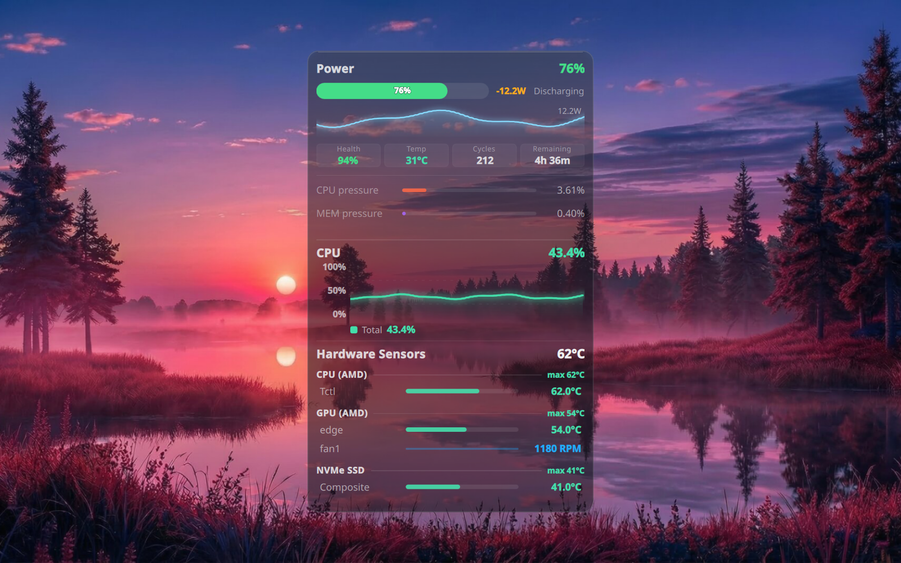
</p>

<details>
  <summary><b>More looks</b></summary>
  <br/>
  <p align="center">
    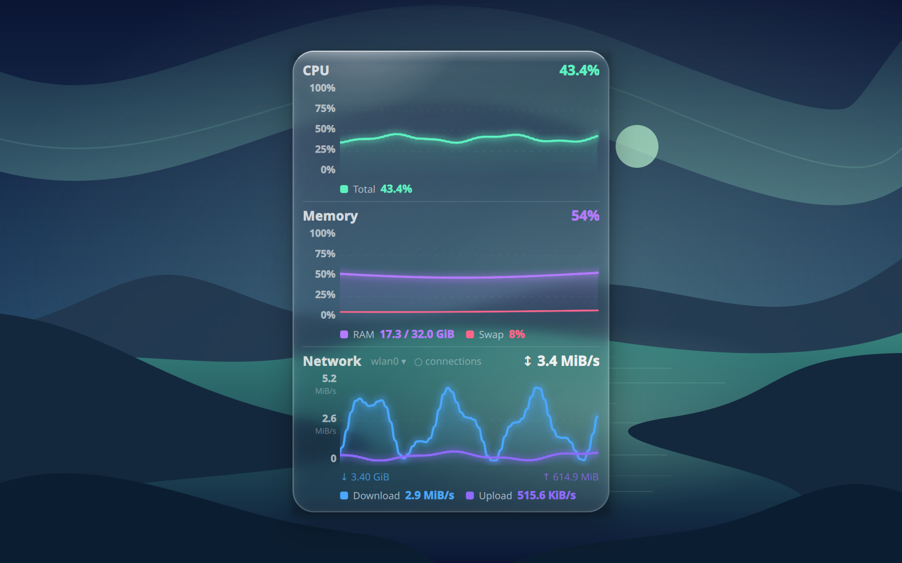
    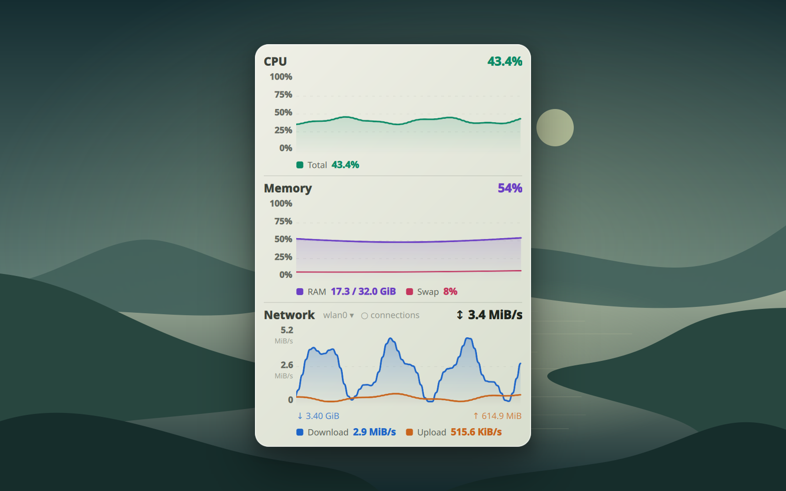
    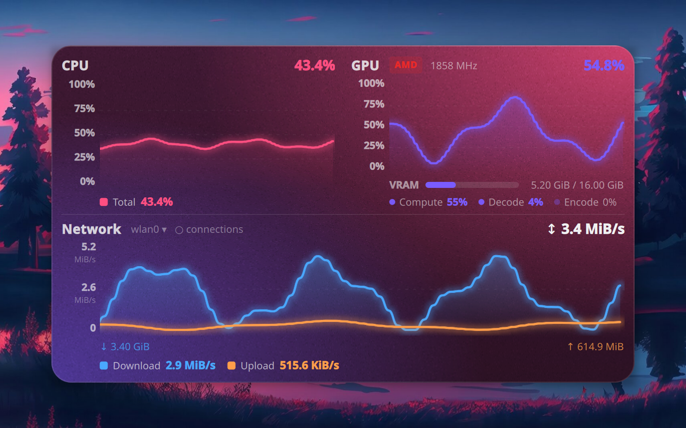
    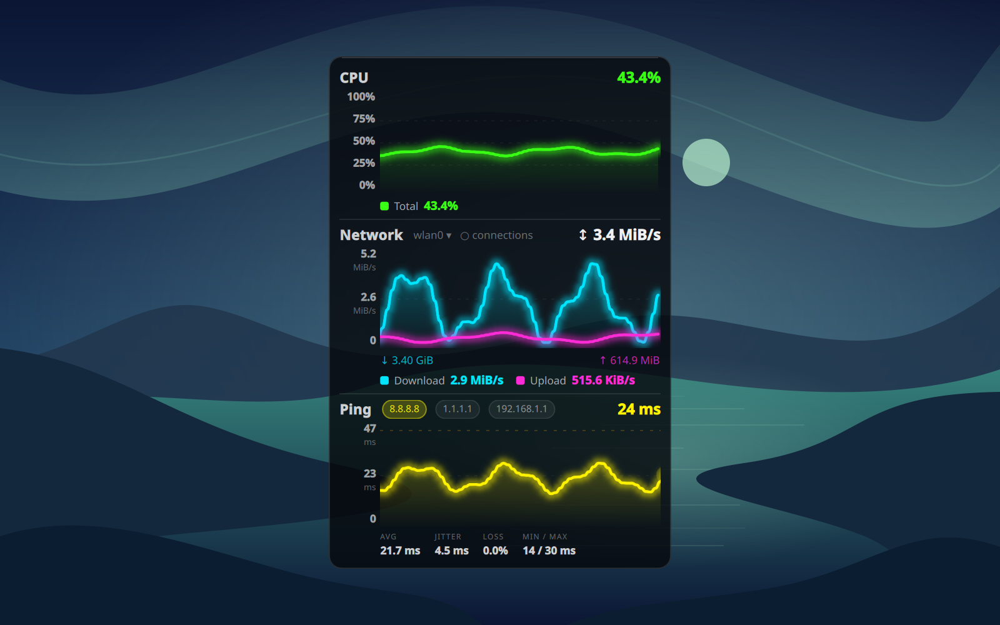
    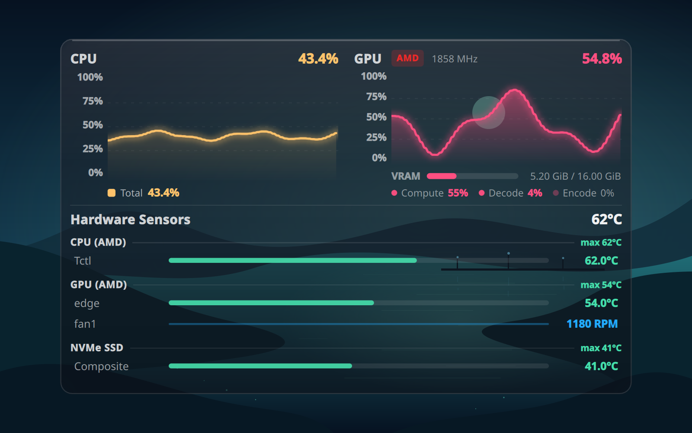
    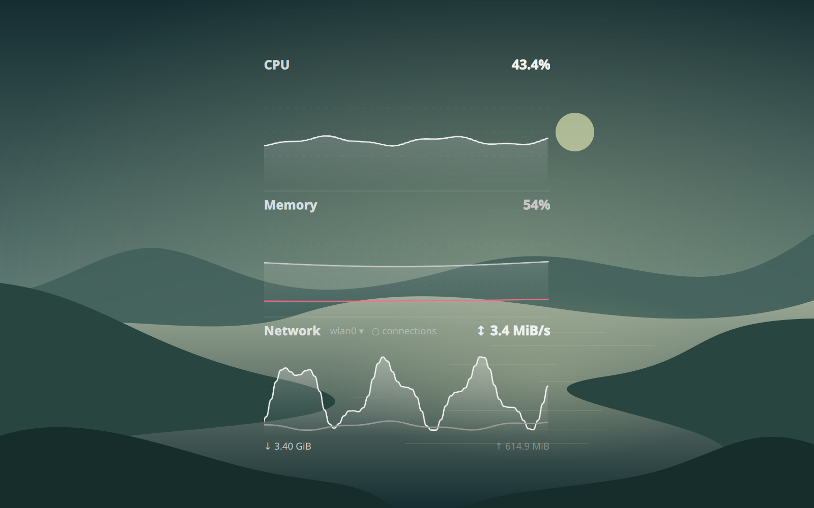
  </p>
</details>

## Studio

<p align="center">
  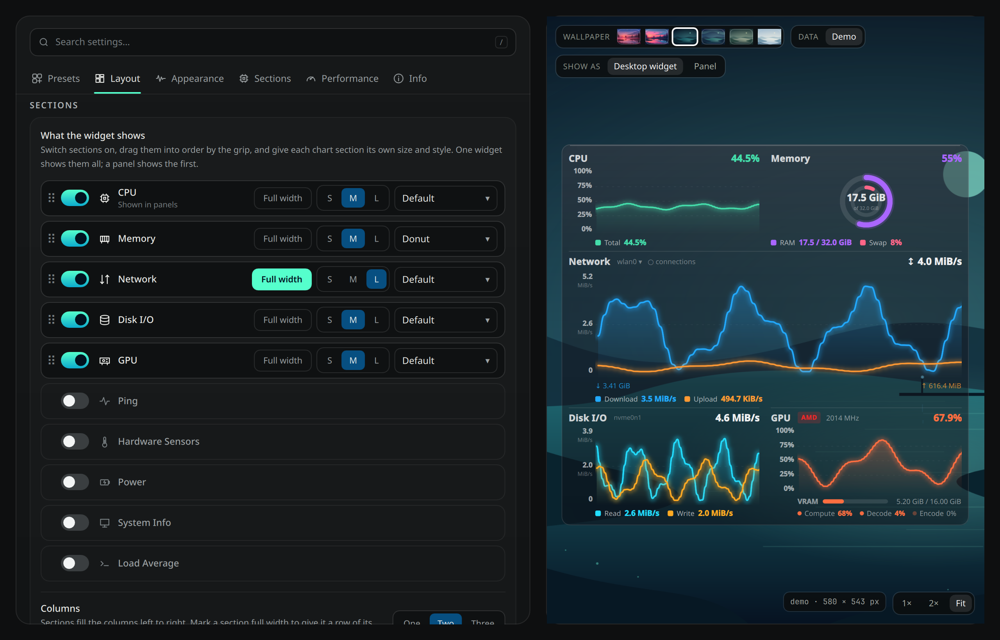
</p>

Right-click the widget → *Configure*. Pick a look, drag sections into order, and see the
result on live or demo data. Looks can be shared as JSON with the
[browser studio](https://muddyblack.github.io/kde-glassy-system-monitor/).

## Network window

<p align="center">
  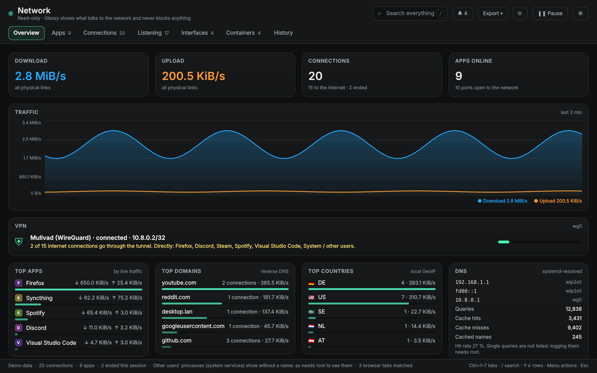
  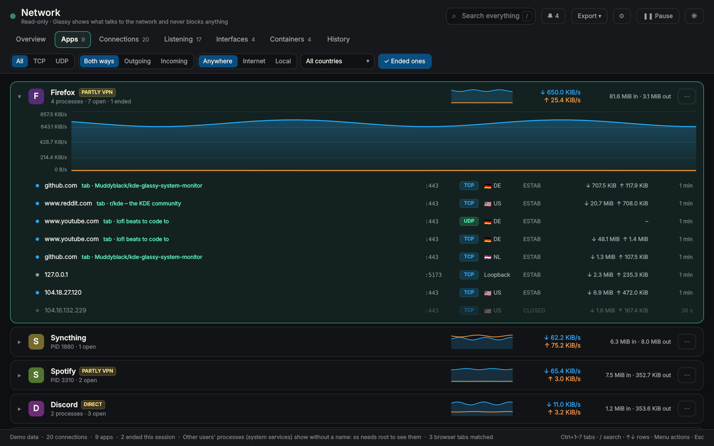
</p>

Which apps talk to what: connections, open ports, interfaces, containers, VPNs and a traffic
history, without root. It opens Wireshark on a connection if you have it.
[More about it](docs/network.md).

## Install

Get it from the [KDE Store](https://www.opendesktop.org/p/2360341), or:

```bash
git clone https://github.com/Muddyblack/kde-glassy-system-monitor.git
cd kde-glassy-system-monitor
kpackagetool6 -t Plasma/Applet -i package
```

NixOS, Hyprland and the optional tools are in the [installation guide](docs/installation.md).

## More

- [Features](docs/features.md)
- [Network window](docs/network.md)
- [How it works](docs/how-it-works.md)
- [Contributing](CONTRIBUTING.md)
