<p align="center">
  
</p>

# Glassy System Monitor

[](https://store.kde.org/)
[](https://kde.org/plasma-desktop/)
[](https://github.com/Muddyblack/kde-glassy-system-monitor)
[](LICENSE)

<p align="center">
  
</p>

A glassy, real-time **ping · CPU · Memory · Network** diagnostic widget for KDE Plasma 6. Unlike built-in network widgets that only show bandwidth, this widget gives you live connection *quality* metrics — scrolling RTT graphs, jitter, and packet loss — alongside system stats.

---

## Features

- **Continuous ping graph** — smooth Bézier line chart rendering RTT in milliseconds, scrolling as new samples arrive
- **Multi-target tabs** — monitor up to 4 hosts simultaneously (e.g. `8.8.8.8`, `1.1.1.1`, your router) and switch with a single click
- **System monitoring graphs** — CPU usage (with per-core overlays), Memory usage (RAM + swap), and Network bandwidth
- **Jitter display** — standard deviation across the rolling history window
- **Packet-loss counter** — lost packets shown as red dots on the graph floor; loss % in the stats bar
- **Alert indicators** — line shifts amber above the latency threshold, red at 1.5×; a pulsing border rings the widget when alerting
- **Glassy aesthetics** — semi-transparent dark glass card with neon glow, matching the [Plasma Audio Visualizer](https://github.com/muddyblack/plasma-audio-visualizer) style

---

## Requirements

| Dependency | Notes |
|---|---|
| KDE Plasma 6 | `X-Plasma-API-Minimum-Version: 6.0` |
| `plasma5support` | Provides the `executable` DataEngine used for ping |
| `ping` (iputils) | Standard on all Linux distros |

---

## Install

### Manual install (any distro)

```bash
git clone https://github.com/Muddyblack/kde-glassy-system-monitor.git
cd kde-glassy-system-monitor
kpackagetool6 -t Plasma/Applet -i package
# or, to update an existing install:
kpackagetool6 -t Plasma/Applet -u package
```

Then right-click your desktop → *Add Widgets* → search **"Glassy System Monitor"**.

To remove: `kpackagetool6 -t Plasma/Applet -r org.muddyblack.glassySystemMonitor`

### Test install (development)

```bash
./test_install.sh
```

To uninstall the test copy:

```bash
kpackagetool6 -t Plasma/Applet -r org.muddyblack.glassySystemMonitorTest
```

### NixOS (flake)

```nix
# flake.nix
{
  inputs.glassy-monitor.url = "github:Muddyblack/kde-glassy-system-monitor";

  outputs = { self, nixpkgs, glassy-monitor, ... }: {
    nixosConfigurations.mybox = nixpkgs.lib.nixosSystem {
      modules = [
        ({ pkgs, ... }: {
          environment.systemPackages = [
            glassy-monitor.packages.${pkgs.system}.default
          ];
        })
      ];
    };
  };
}
```

### Package as `.plasmoid` (for KDE Store)

```bash
./pack.sh
# produces glassy-system-monitor-<version>.plasmoid
```

---

## Configuration

All settings are available via the widget's right-click → Configure menu:

| Setting | Default | Description |
|---|---|---|
| **Hosts** | `8.8.8.8,1.1.1.1,192.168.1.1` | Comma-separated ping targets (max 4) |
| **Ping interval** | `2 s` | Time between successive pings |
| **Timeout** | `2 s` | Per-ping timeout — counts as packet loss |
| **History points** | `60` | Rolling sample count kept per target |
| **Latency warning** | `100 ms` | Line turns amber above this threshold |
| **Loss warning** | `5 %` | Alert border activates above this loss rate |
| **Line color** | system accent | Or pick a custom neon color |
| **Glow** | on | Neon shadow on the graph line |
| **Stats bar** | on | Shows jitter, loss, min/max beneath the graph |
| **Background card** | on | Semi-transparent glass card behind the widget |
