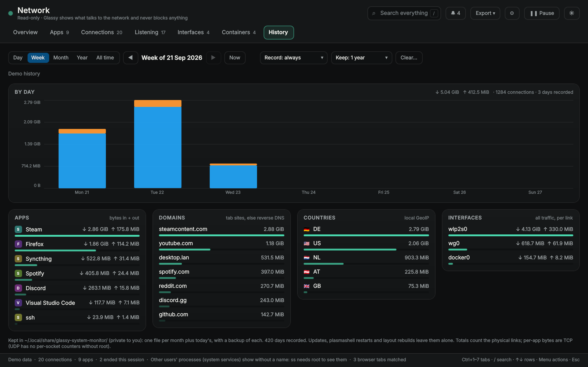
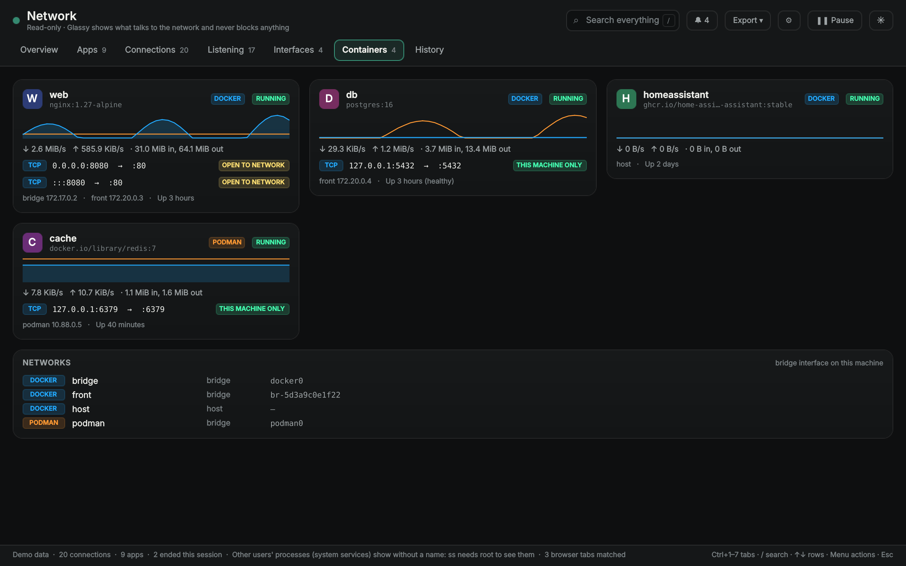

# The network window

The ⧉ link in the network section opens a separate, resizable window in the spirit of
Portmaster. It is read-only (Glassy never blocks anything) and runs without root.

<p align="center">
  
  
  
  
</p>

## Pages

- **Overview**: live download / upload chart, connection and app counts, top apps, domains and
  countries, DNS servers and resolver counters
- **Apps**: every app with its icon and live rate; browser and Electron helpers are grouped
  under their app; expand for each connection and its chart
- **Connections**: a sortable, filterable table (app, domain, IP, port, protocol, direction,
  state, country, bytes, since); connections that ended stay greyed for the session
- **Listening**: open ports per app, with ports open to the network in the warning colour
- **Interfaces**: addresses, MAC, link speed, gateway, DNS, Wi-Fi SSID / signal / band, live rates
- **Containers**: Docker and Podman containers with their published ports (open to the network
  or not), networks, addresses and live traffic; ports a container publishes are grouped under
  it on the Listening page, and bridges are named on the Interfaces page
- **History**: a day by hour, a week or month by day, a year or everything by month; ◀ ▶ to step
  back and forth, a click on a bar to open it; per app, domain, country and interface (usage per
  link, handy for metered connections)

Search, filters, pause, light / dark and keyboard navigation (Ctrl+1–7, `/`, arrows, Menu) work
everywhere. Every chart shows the values under the pointer. The panel pill can show the busiest
network app too (Layout › In a panel › Network apps).

## Per connection

The row menu copies the IP, domain or address:port, opens whois or a map (only on click), shows
the connection's round-trip time as a chart with a trace route (tracepath, traceroute or mtr),
trusts an app, sets a daily limit, or ends the process (asks first). Without root, `ss` cannot
name other users' processes: they show as "System / other users".

## Browser tabs

Connections of Firefox (and Zen, LibreWolf, Floorp, Waterfox) and Chromium-based browsers are
matched to your open tabs by address, read from the browsers' own session files. Only host names
are read, they stay in memory, and it can be switched off.

## History

Recorded in the background (a slow poll) while the widget runs. You choose whether it records
(always, only while the window is open, or not at all), whether it is saved or only kept in
memory, and for how long (30 / 90 days, 1 or 2 years, forever; one year by default).

It lives in `~/.local/share/glassy-system-monitor/`, so reboots, plasmashell restarts,
`plasma-layout-rebuild` and updates keep it. Saves are atomic with a `.bak` and daily copies, and
a damaged or newer file is never overwritten. The files are `700` / `600`; today's history (a few
KB) is saved every five minutes and older days once a day. Export writes the connections as CSV
and the history as CSV or JSON into Downloads.

## Alerts

Each can be switched off, as desktop notifications and in the window's bell: a new app goes
online, a port opens to the network, a VPN drops, an app reaches its daily limit. Trusted apps
get a ✓ and stay quiet; apps first seen lately are marked NEW.

An optional password locks the window (a salted hash is kept, never the password).

## VPN and firewall

NordVPN, Proton VPN, Mullvad, Tailscale, WireGuard, OpenVPN, Cloudflare WARP, ZeroTier, NetBird
and more are recognised; the window shows which connections and apps go through the tunnel and
which leave directly.

firewalld's zone and the NixOS firewall's open ports are read (no password), and each open port
says whether the firewall lets it in. ufw and plain nftables keep their rules for root, and
Glassy says so instead of asking.

## Wireshark

When Wireshark is installed, it opens straight on a connection, all of an app's connections, a
listening port, an interface or a container, with the capture filter already set (🦈 in the row
menu and on the cards; the Flatpak works too).

**🦈 Capture** runs `tshark` for 5–30 seconds, only when you ask, to learn the names behind bare
addresses from DNS answers and TLS / QUIC server names. The names fill the Domain column for the
session; nothing is saved. Capturing needs the `wireshark` group:

```nix
programs.wireshark.enable = true;
users.users.<you>.extraGroups = [ "wireshark" ];
```

(elsewhere: `sudo usermod -aG wireshark $USER`, then log in again). Glassy never asks for a
password.

## Countries and owners (GeoIP)

All local: Glassy reads a `.mmdb` database (db-ip Lite or MaxMind GeoLite2) with `mmdblookup`;
nothing is looked up online. The window's **🌍 Show countries…** button shows what is installed,
downloads db-ip's free Lite databases (CC BY 4.0) into `~/.local/share/GeoIP` on a click, and
lists the install command for `mmdblookup` (`pacman -S libmaxminddb`, `apt install mmdb-bin`,
`dnf install libmaxminddb`). On NixOS the flake does all of it:

```nix
# flake inputs: glassy.url = "github:Muddyblack/kde-glassy-system-monitor";
imports = [ glassy.nixosModules.default ];          # or glassy.homeManagerModules.default
programs.glassy-system-monitor = { enable = true; geoip = true; };
```

It installs the widget, `mmdblookup` and nixpkgs' `dbip-country-lite` / `dbip-asn-lite`, and sets
`GLASSY_GEOIP_COUNTRY` / `GLASSY_GEOIP_ASN` so Glassy finds them. `nix run .#view-hyprland` has
them built in.

## What it reads

`ss` for sockets, `/proc` for processes and traffic, `.desktop` files for app names and icons,
`getent` and the GeoIP database for names and places, `resolvectl --no-ask-password` for DNS.
The process table is read only when a new process appears. Nothing asks for a password and
nothing talks to NetworkManager.
